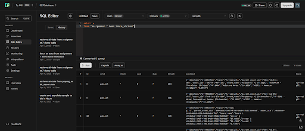
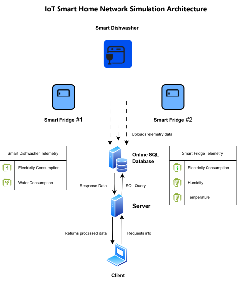
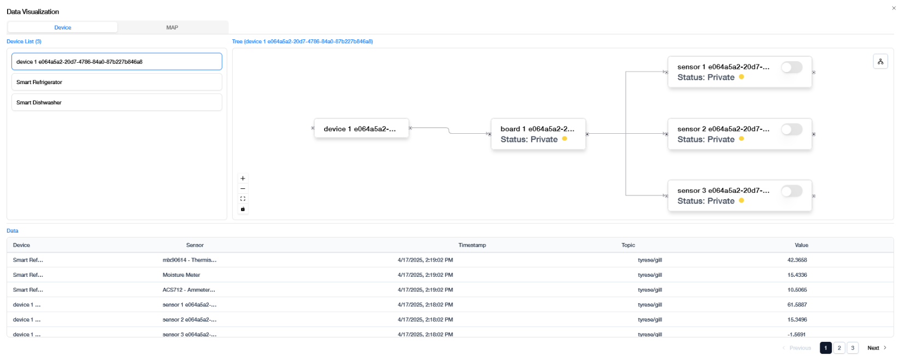
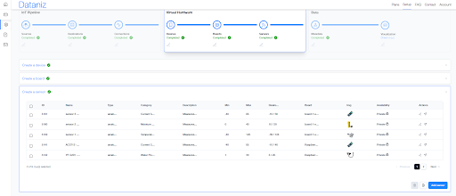

<div align="center">
    <h1>IoT Smart Home Network Simulation</h1>
    
</div>

<details>
    <summary>Table of Contents</summary>
    <ol>
        <li>
        <a href="#about-the-project">About The Project</a>
        <ul>
            <li><a href="#built-with">Built With</a></li>
        </ul>
        </li>
        <li>
            <a href="#documentation">Documentation</a>
        </li>
        <li>
            <a href="#data-generation">Data Generation</a>
        </li>
        <li>
            <a href="#getting-started">Getting Started</a>
            <ul>
                <li><a href="#prerequisites">Prerequisites</a></li>
                <li><a href="#installation">Installation</a></li>
                <li><a href="#database-setup">Database Setup</a></li>
                <li><a href="#run-server">Run Server</a></li>
                <li><a href="#run-client">Run Client</a></li>
                <li><a href="#networking-considerations">Networking Considerations</a></li>
            </ul>
        </li>
        <li>
            <a href="#acknowledgements">Acknowledgements</a>
        </li>
    </ol>
</details>

## About the Project
The **IoT Smart Home Network Simulation** is a Python-based client-server application that simulates communication between IoT devices and a smart home server. The project demonstrates core networking concepts by transmitting device telemetry data over a network, storing sensor readings in a SQL database, and analyzing collected data to identify trends and device behavior.

The system models a connected smart home environment where simulated IoT devices generate and send telemetry information to a server for processing and storage. Features include socket-based network communication, database integration, and data analysis workflows that transform raw telemetry into actionable insights.

### Built With

#### Programming Languages
- [![Python][Python-icon]][Python-url]

#### Database
- [![Neon][Neon-icon]][Neon-url]

    - 

#### Data Generation & Simulation
- [![Dataniz][Dataniz-icon]][Dataniz-url]

#### Essential Libraries
- [![python-dotenv][python-dotenv-icon]][python-dotenv-url]
- [![psycopg2][psycopg2-icon]][psycopg2-url]
- [![pytz][pytz-icon]][pytz-url]

## Documentation



## Data Generation



- Telemetry data is generated using Dataniz virtual IoT devices configured to simulate a smart home environment.
- The simulation consists of virtual smart appliances that continuously generate sensor measurements such as electricity consumption, water consumption, humidity, and temperature.

## Getting Started
Follow the steps below to set up and run the IoT Smart Home Network Simulation.

### Prerequisites
Before starting, ensure the following software is installed:
 
- Two computers with access to Python 3.11 or higher
- Access to an online SQL database

Supported cloud database providers include:

| Database                                                                          | Free? |
| ----------------------------------------------------------------------------------|-------|
| [![Amazon-RDS][Amazon-RDS-icon]][Amazon-RDS-url]                                  |    ❌ |
| [![Google-Cloud-SQL][Google-Cloud-SQL-icon]][Google-Cloud-SQL-url]                |    ❌ |
| [![MS-Azure-SQL-Database][MS-Azure-SQL-Database-icon]][MS-Azure-SQL-Database-url] |    ❌ |
| [![Neon][Neon-icon]][Neon-url]                                                    |    ✅ |
| [![PlanetScale][PlanetScale-icon]][PlanetScale-url]                               |    ✅ |
| [![Postgresql][Postgresql-icon]][Postgresql-url]                                  |    ✅ |
| [![Supabase][Supabase-icon]][Supabase-url]                                        |    ✅ |
| [![Railway][Railway-icon]][Railway-url]                                           |    ❌ |

> [!NOTE]
> The project was developed and tested using Neon PostgreSQL. Alternative providers such as the ones listed above may also work with minimal configuration changes.

### Installation

1. Clone the repository with:
```bash
git clone <repository-url>
```
and
```bash
cd <repository-name>
```

2. Install project dependencies.
```bash
pip install -r requirements.txt
```

### Database Setup
1. Create a database using a provider such as Neon.
2. Obtain the database connection string.
3. Create a ```.env``` file in the same directory as `echo_server.py`:
```
DATABASE_CONNECTION_STRING="your_connection_string_here"
```

> [!IMPORTANT]
> Store `DATABASE_CONNECTION_STRING` in a `.env` file rather than directly in `echo_server.py` to avoid exposing database credentials.

4. Populate the database using [Dataniz](https://www.dataniz.com/).



- The virtual devices are configured to transmit telemetry data to the online database, allowing the server to query and analyze live sensor measurements.

### Run Server
Navigate to the project directory holding `echo_server.py`, then run the command:
```
python echo_server.py <server-ip> <port>
```

### Run Client
Run the command: 
```
python ./echo_client.py
```
Enter the server IP address and port number when prompted.

Available commands:
```
1 - Device Status
2 - Sensor Summary
3 - Network Information
```

### Networking Considerations

#### IP Address Selection
- If the client and server are running on the same machine, use `127.0.0.1` or `localhost`.
- If connecting over a local network, use the server's private IP address (for example, `192.168.x.x`).
- If connecting over the Internet, use the server's public IP address.

> [!TIP]
> You can discover your public IP address using services such as https://whatismyipaddress.com or https://www.whatismyip.com.

#### VPN Compatibility
If connecting devices across different networks, verify that any VPN software is disabled or configured appropriately. VPN clients may override routing rules or block traffic on ports that would otherwise be accessible. During development, VPN software interfered with communication between the client and server despite the necessary ports being opened.

#### Firewall and Port Forwarding
Cross-network communication may require additional network configuration. Depending on your router and firewall settings, you may need to:
- Create a firewall rule permitting inbound traffic on the server's listening port.
- Configure port forwarding on the router hosting the server.
- Use the server's public IP address when connecting from outside the local network.

## Acknowledgements

[![diagrams.net][diagrams.net-icon]][diagrams.net-url]
- Used to create the above visualizations illustrating data flow, component interactions, and system design decisions in [Documentation](#documentation) section.

[![Github][Github-icon]][Github-url]

- Borrowed template formatting based on [othneildrew's](https://github.com/othneildrew) "Best-README-Template".

[![StackOverflow][StackOverflow-icon]][StackOverflow-url]

- Used provided method to get the offset aware datetime.

[![WikimediaCommons][WikimediaCommons-icon]][WikimediaCommons-url-1]

- Fridge Icon used in documentation.
- CoreUI, CC BY 4.0 <https://creativecommons.org/licenses/by/4.0>, via Wikimedia Commons.
    - The image was modified for the purposes of the documentation to maintain a consistent color scheme.

[![WikimediaCommons][WikimediaCommons-icon]][WikimediaCommons-url-2]

- Dishwasher icon used in documentation.
- Microsoft Corporation, MIT <http://opensource.org/licenses/mit-license.php>, via Wikimedia Commons.

<!-- MARKDOWN LINKS & IMAGES -->
<!-- https://www.markdownguide.org/basic-syntax/#reference-style-links -->

<!-- Programming Languages -->
[Python-icon]: https://img.shields.io/badge/Python-3776AB?style=for-the-badge&logo=python&logoColor=white
[Python-url]: https://www.python.org/

<!-- Libraries -->
[python-dotenv-icon]: https://img.shields.io/badge/python--dotenv-ECD53F
[python-dotenv-url]: https://githubon-dotenv
[psycopg2-icon]: https://img.shields.io/badge/psycopg2-4169E1
[psycopg2-url]: https://www.psycopg.org/
[pytz-icon]: https://img.shields.io/badge/pytz-377
[pytz-url]: https://pypi.org/project/pytz/

<!-- Databases -->
[Neon-icon]: https://img.shields.io/badge/Neon-00E699?style=for-the-badge&logo=neon&logoColor=black
[Neon-url]: https://neon.tech
[Postgresql-icon]: https://img.shields.io/badge/PostgreSQL-4169E1?style=for-the-badge&logo=postgresql&logoColor=white
[Postgresql-url]: https://www.postgresql.org/
[Supabase-icon]: https://img.shields.io/badge/Supabase-3ECF8E?style=for-the-badge&logo=supabase&
[Supabase-url]: https://supabase.com/database
[PlanetScale-icon]: https://img.shields.io/badge/PlanetScale-000000?style=for-the-badge&logo=planetscale&logoColor=white
[PlanetScale-url]: https://planetscale.com/

[Amazon-RDS-icon]: https://img.shields.io/badge/Amazon_RDS-527FFF?style=for-the-badge&logo=amazonaws&logoColor=white
[Amazon-RDS-url]: https://aws.amazon.com/rds/
[Google-Cloud-SQL-icon]: https://img.shields.io/badge/Google_Cloud_SQL-4285F4?style=for-the-badge&logo=googlecloud&logoColor=white
[Google-Cloud-SQL-url]: https://cloud.google.com/sql
[MS-Azure-SQL-Database-icon]: https://img.shields.io/badge/Azure_SQL-0078D4?style=for-the-badge&logo=microsoftazure&logoColor=white
[MS-Azure-SQL-Database-url]: https://azure.microsoft.com/en-us/products/azure-sql/database/
[Railway-icon]: https://img.shields.io/badge/Railway-0B0D0E?style=for-the-badge&logo=railway&logoColor=white
[Railway-url]: https://docs.railway.com/databases

[Dataniz-icon]: https://img.shields.io/badge/Dataniz-Data_Enrichment-blue?style=for-the-badge
[Dataniz-url]: https://www.dataniz.com/

<!-- Acknowledgements -->
[diagrams.net-icon]: https://img.shields.io/badge/diagrams.net-F08705?style=for-the-badge&logo=diagramsdotnet&logoColor=white
[diagrams.net-url]: https://www.diagrams.net/
[Github-icon]: https://img.shields.io/badge/GitHub-%23121011.svg?style=for-the-badge&logo=github&logoColor=white
[Github-url]: https://github.com/othneildrew/Best-README-Template/
[StackOverflow-icon]: https://img.shields.io/badge/-Stack%20Overflow-FE7A16?style=for-the-badge&logo=stack-overflow&logoColor=white
[StackOverflow-url]: https://stackoverflow.com/questions/56287435/convert-datetime-min-into-offset-aware-datetimehow-to-generate-feature-importance-plots-from-scikit-learn/
[WikimediaCommons-icon]: https://img.shields.io/badge/Wikimedia_Commons-006699?style=for-the-badge&logo=wikimediacommons&logoColor=white
[WikimediaCommons-url-1]: https://commons.wikimedia.org/wiki/File:Fridge_(CoreUI_Icons_v1.0.0).svg
[WikimediaCommons-url-2]: https://commons.wikimedia.org/wiki/File:Microsoft_Fluent_UI_%E2%80%93_ic_fluent_dishwasher_32_regular.svg
